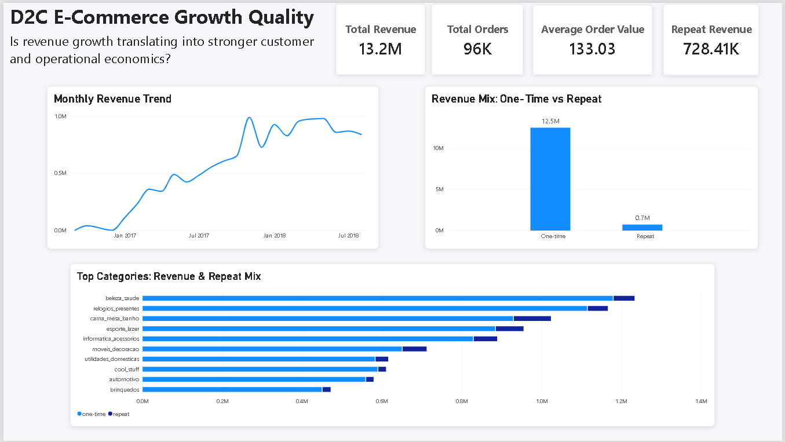
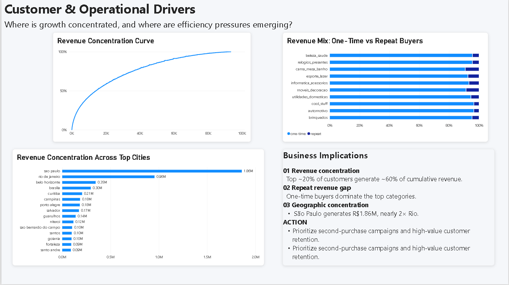

# 📊 D2C E-Commerce Growth Quality Analysis

**SQL + Power BI case study evaluating whether e-commerce growth is healthy, sustainable, and retention-led.**

---

## 🔎 Business Question

Is revenue growth translating into stronger customer economics — or is the business increasingly dependent on one-time purchases and concentrated revenue sources?

The analysis evaluates:

- customer purchase structure
- revenue concentration
- category-level one-time vs repeat revenue
- revenue trends over time
- geographic revenue concentration
- freight cost pressure as an operational proxy

---

## 🗂 Dataset

**Source:** Brazilian E-Commerce Public Dataset by Olist

The dataset contains transactional information across orders, order items, customers, products, sellers, payments, reviews, and geolocation.

The analysis primarily uses:

| Table | Purpose |
|---|---|
| `orders` | Order status and timestamps |
| `order_items` | Item-level price and freight values |
| `customers` | Customer-level aggregation |
| `products` | Product/category analysis |
| `geolocation` | City-level analysis |

Only delivered orders are included in the core revenue analysis.

---

## 🛠 Analytical Approach

### SQL — Analytical Layer

PostgreSQL was used to perform the underlying analysis, including:

- multi-table joins
- CTE-based query structuring
- customer segmentation
- revenue concentration analysis
- category-level revenue analysis
- time-series analysis
- city-level efficiency analysis
- freight cost analysis
- window functions for ranking and cumulative revenue

### Power BI — Visualization Layer

The SQL outputs were then used to build a two-page executive dashboard focused on business storytelling rather than chart volume.

The dashboard communicates:

1. **Growth quality** — revenue trend, order volume, AOV, and one-time vs repeat revenue
2. **Structural drivers** — customer revenue concentration, category dependency, and geographic concentration
3. **Business implications** — concise findings and recommended actions

---

# 📊 Power BI Dashboard

## Page 1 — D2C E-Commerce Growth Quality

The executive overview evaluates whether revenue growth is translating into stronger customer economics.

**Key views:**
- Monthly revenue trend
- Revenue by customer type
- Top categories by revenue and repeat mix
- Total revenue, orders, AOV, and repeat revenue KPIs



## Page 2 — Customer & Operational Drivers

The second page focuses on structural concentration and the business implications of the observed growth pattern.

**Key views:**
- Revenue concentration curve
- One-time vs repeat revenue mix by category
- Revenue concentration across top cities
- Business implications and recommended actions



**Editable Power BI file:** [`D2C-Ecommerce-Growth-Quality.pbix`](dashboard/D2C-Ecommerce-Growth-Quality.pbix)

---

# 📌 Key Findings

### 1. Revenue is highly concentrated

Approximately the top 20% of customers account for roughly 60% of cumulative revenue, indicating meaningful dependence on a relatively small group of customers.

### 2. One-time buyers dominate revenue

Repeat revenue remains a small share of total revenue and is limited across the highest-revenue categories, suggesting that growth is more acquisition-led than retention-led.

### 3. Revenue is geographically concentrated

São Paulo generates approximately **R$1.86M**, nearly twice Rio de Janeiro at approximately **R$0.96M**.

---

# 💡 Business Recommendations

- Prioritize second-purchase and retention initiatives for high-value customers.
- Use category-level repeat revenue performance to identify stronger retention opportunities.
- Concentrate expansion efforts on proven high-revenue markets before broad geographic scaling.

---

## ⚠ Limitations

- No product cost or complete operating-cost data is available, so true profit/margin cannot be calculated.
- No marketing or customer acquisition cost data is available.
- Customer demographics are not available.
- Freight percentage can become unstable for very low-revenue, one-order cities; it is therefore treated as an operational pressure proxy rather than a standalone profitability metric.
- The Olist dataset represents Brazilian e-commerce and is used as the source context for this D2C case study.

---

## 📂 Repository Structure

```text
📁 sql/
   ├── 01_customer_segmentation.sql
   ├── 02_revenue_concentration.sql
   ├── 03_category_analysis.sql
   ├── 04_city_analysis.sql
   ├── 05_time_trend_analysis.sql
   └── 06_freight_efficiency_analysis.sql

📁 dashboard/
   ├── D2C-Ecommerce-Growth-Quality.pbix
   ├── D2C-Ecommerce-Growth-Quality.png
   └── Customer-Operational-Drivers.png

README.md
```

---

## 💡 Skills Demonstrated

- PostgreSQL
- Multi-table joins
- CTEs
- Window functions
- Customer segmentation
- Revenue concentration analysis
- Category analysis
- Time-series analysis
- Geographic analysis
- Power BI dashboard development
- Business storytelling and recommendations

---

*👤 Aashka Tanvi — D2C E-Commerce Growth Quality Analysis*
